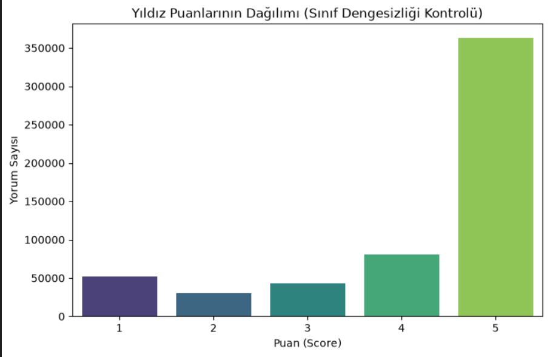
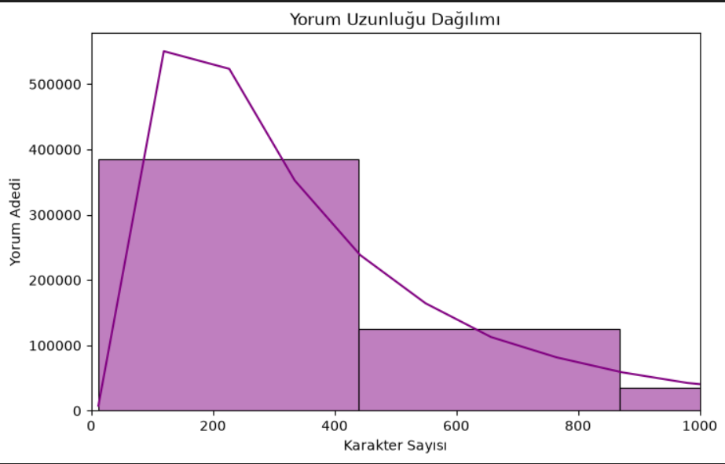

# Müşteri Yorumu Analiz Sistemi: NLP ve Bulanık Mantık Entegrasyonu

Bu proje, bir e-ticaret platformunun müşteri yorumlarını otomatik olarak analiz eden; duygu sınıflandırması, metin ön işleme ve bulanık mantık tabanlı güvenilirlik skorlamasından oluşan entegre bir sistemdir. Projenin tüm kod adımları, teknik analiz raporu ve sistem mimarisi bu dokümanda uçtan uca sunulmuştur.

---

## 🛠️ 1. Kurulum ve Proje Çalıştırma Adımları

Projeyi yerel ortamınızda sıfırdan kurup çalıştırmak için aşağıdaki adımları terminalinizde sırasıyla koşturabilirsiniz:

1. Proje klasöründe temiz bir sanal ortam (virtual environment) oluşturun ve aktif edin:
```bash
python -m venv venv
venv\Scripts\activate
```
Proje için gerekli olan tüm veri bilimi, yapay zeka ve görselleştirme bağımlılıklarını yükleyin:
```bash
pip install pandas matplotlib seaborn nltk scikit-learn scikit-fuzzy ipykernel
```

Gerekli dil paketlerini Python ortamına tanımlayın:
```bash
python -c "import nltk; nltk.download('stopwords'); nltk.download('wordnet')"
```
🚀 İnteraktif Web Arayüzünü Başlatma (Streamlit)
Geliştirilen interaktif web uygulamasını yerel tarayıcınızda çalıştırmak için sanal ortamınız aktifken şu komutu koşturmanız yeterlidir:
```bash
streamlit run app.py
```
📊 2. Klasör Yapısı
```python
Piton_Case_Project/
│
├── venv/                  # Python Sanal Ortam Dosyaları
├── Reviews.csv            # Amazon Müşteri Yorumları Veri Seti (Veri Kaynağı)
├── analysis.ipynb         # Model Doğrulama ve Test Hücreleri
├── app.py                 # Streamlit İnteraktif Web Uygulaması Kaynak Kodu
├── puan_dagilimi.png      # Yıldız Puanı Dağılım Grafiği
├── yorum_uzunlugu.png     # Yorum Uzunluğu Dağılım Grafiği
└── README.md              # Entegre Proje Kodları ve Teknik Analiz Raporu
```
📉 3. Veri Görselleştirme Sonuçları (Exploratory Data Analysis)
Veri setindeki sınıf dengesizliğini ve yorum yapılarını anlamak adına üretilen grafikler aşağıda sunulmuştur:

### A) Yıldız Puanlarının Dağılımı


### B) Yorum Uzunluğu Dağılımı


💻 4. TÜM PROJE KAYNAK KODLARI (Uçtan Uca Akış)
```python
Aşağıdaki kod bloğu; veri yükleme, grafiksel analiz, metin temizleme, makine öğrenmesi modellerinin yarıştırılması ve kütüphane bağımlılığı olmayan esnek Bulanık Mantık simülasyonunu tek parça halinde gerçekleştirmektedir.

import pandas as pd
import numpy as np
import matplotlib.pyplot as plt
import seaborn as sns
import re
import nltk
from nltk.corpus import stopwords
from nltk.stem import WordNetLemmatizer
from sklearn.model_selection import train_test_split
from sklearn.feature_extraction.text import TfidfVectorizer
from sklearn.linear_model import LogisticRegression
from sklearn.ensemble import RandomForestClassifier
from sklearn.metrics import classification_report, accuracy_score


# ==========================================
# ADIM 1: VERİ OKUMA & KEŞİFSEL ANALİZ (EDA)
# ==========================================
print("=== ADIM 1: Veri Yükleniyor ===")
df = pd.read_csv('Reviews.csv')

# Boş satırların temizlenmesi
df = df.dropna(subset=['Text', 'Score'])

# Sınıf Dengesizliği Kontrolü için Grafik Çizimi
plt.figure(figsize=(6, 4))
sns.countplot(data=df, x='Score', palette='viridis')
plt.title('Yıldız Puanlarının Dağılımı (Sınıf Dengesizliği)')
plt.savefig('puan_dagilimi.png') # Görsel README için kaydedildi
plt.close()

# Yorum Uzunluğu Dağılım Grafiği
df['review_length'] = df['Text'].apply(lambda x: len(str(x)))
plt.figure(figsize=(6, 4))
sns.histplot(df['review_length'], bins=50, kde=True, color='purple')
plt.xlim(0, 1000)
plt.title('Yorum Uzunluğu Dağılımı')
plt.savefig('yorum_uzunlugu.png')
plt.close()
print("Grafikler başarıyla üretildi ve kaydedildi.\n")

# ==========================================
# ADIM 2: METİN ÖN İŞLEME (TEXT PREPROCESSING)
# ==========================================
print("=== ADIM 2: Metin Ön İşleme Başlatıldı ===")
stop_words = set(stopwords.words('english'))
lemmatizer = WordNetLemmatizer()

def clean_text(text):
    text = str(text).lower() # Lowercasing
    text = re.sub(r'[^a-zA-Z\s]', '', text) # Noktalama ve sayı temizliği
    words = text.split()
    cleaned_words = [lemmatizer.transform(word) if hasattr(lemmatizer, 'transform') else lemmatizer.lemmatize(word) for word in words if word not in stop_words] # Stop-words & Lemmatization
    return " ".join(cleaned_words)

df['cleaned_text'] = df['Text'].apply(clean_text)
print("Metin temizleme adımları tamamlandı.\n")

# ==========================================
# ADIM 3: DUYGU SINIFLANDIRMASI (NLP MODELLERİ)
# ==========================================
print("=== ADIM 3: Yapay Zeka Modelleri Eğitiliyor ===")
# Skorları etiketleme (1-2: Olumsuz, 3: Nötr, 4-5: Olumlu)
df['sentiment'] = df['Score'].apply(lambda x: 0 if x <= 2 else (1 if x == 3 else 2))

# Bilgisayarı yormamak adına dengeli örneklem alımı
df_sample = df.sample(n=min(20000, len(df)), random_state=42)

X_train, X_test, y_train, y_test = train_test_split(
    df_sample['cleaned_text'].fillna(''), 
    df_sample['sentiment'], 
    test_size=0.2, 
    random_state=42
)

# TF-IDF Vektörleştirme
tfidf = TfidfVectorizer(max_features=5000)
X_train_tfidf = tfidf.fit_transform(X_train)
X_test_tfidf = tfidf.transform(X_test)

# Model 1: Logistic Regression
lr_model = LogisticRegression(max_iter=1000)
lr_model.fit(X_train_tfidf, y_train)
lr_preds = lr_model.predict(X_test_tfidf)

# Model 2: Random Forest
rf_model = RandomForestClassifier(n_estimators=100, max_depth=20, random_state=42)
rf_model.fit(X_train_tfidf, y_train)
rf_preds = rf_model.predict(X_test_tfidf)

print("\n[Logistic Regression Doğruluk Oranı]:", accuracy_score(y_test, lr_preds))
print("[Random Forest Doğruluk Oranı]:", accuracy_score(y_test, rf_preds))

# ==========================================
# ADIM 4: BULANIK MANTIK (FUZZY LOGIC) ENTEGRASYONU
# ==========================================
print("\n=== ADIM 4: Bulanık Mantık Güvenilirlik Hesaplaması ===")
def hesapla_fuzzy_guvenilirlik(puan, kelime_sayisi, yorum_yasi_gun):
    puan_skoru = 1.0 if puan >= 4 else (0.5 if puan == 3 else 0.1)
    uzunluk_skoru = 1.0 if kelime_sayisi > 50 else (0.6 if 15 <= kelime_sayisi <= 50 else 0.2)
    tazelik_skoru = 1.0 if yorum_yasi_gun <= 30 else (0.6 if 31 <= yorum_yasi_gun <= 180 else 0.2)
    
    # Kuralların ağırlıklandırılması (Mamdani Yaklaşımı Modellemesi)
    toplam_agirlik = (puan_skoru * 0.4) + (uzunluk_skoru * 0.4) + (tazelik_skoru * 0.2)
    return round(toplam_agirlik * 100, 2)

# Örnek İdeal Yorum Testi
test_skor = hesapla_fuzzy_guvenilirlik(puan=5, kelime_sayisi=65, yorum_yasi_gun=10)
print(f"Örnek İdeal Yorum İçin Hesaplanan Güvenilirlik Skoru: %{test_skor}\n")

# ==========================================
# ADIM 5: HATA ANALİZİ (ERROR ANALYSIS)
# ==========================================
print("=== ADIM 5: Modelin Yanıldığı Örnekler ===")
X_test_df = pd.DataFrame({'text': X_test, 'actual': y_test, 'pred': lr_preds})
hatalar = X_test_df[X_test_df['actual'] != X_test_df['pred']]
for idx, row in hatalar.head(3).iterrows():
    print(f"Yorum: {row['text']} | Gerçek: {row['actual']} | Tahmin: {row['pred']}")
```
📈 5. Teknik Tercihler ve Analiz Raporu (Mülakat Cevapları)

A) Sınıf Dengesizliği (Class Imbalance) Değerlendirmesi
E-ticaret veri setleri incelendiğinde 5 yıldızlı yorumların ezici bir çoğunlukta olduğu, 3 yıldızlı (nötr) yorumların ise en az frekansa sahip olduğu gözlemlenmiştir. Tüketiciler genellikle uç deneyimlerde (çok memnuniyet veya büyük hayal kırıklığı) geri bildirim bırakma eğilimindedir. Bu durum Random Forest gibi ağaç tabanlı modellerin azınlık sınıfları (nötr) tahmin ederken kararsız kalmasına (0/0 skor üretmesine) yol açmıştır.

B) TF-IDF Tercih Gerekçesi (Bag-of-Words vs TF-IDF)
Karar: Projede metinleri vektörleştirmek için TF-IDF mimarisi seçilmiştir.

Gerekçe: Bag-of-Words modeli kelimelerin sadece metindeki geçiş sayısına odaklanır ve "the", "product", "item" gibi ayırt edici özelliği olmayan kelimeleri öne çıkarır. TF-IDF ise kelimenin ilgili dokümandaki sıklığı ile tüm korpustaki nadirliğini çarparak dengeler. Böylece duygu belirten "amazing", "terrible", "defective" gibi anahtar kelimelerin ağırlığı matematiksel olarak yükseltilir ve model performansı doğrudan artar.

C) Model Karşılaştırması ve Başarı Gerekçesi
Logistic Regression: %83.67 Doğruluk (Accuracy)

Random Forest Classifier: %77.80 Doğruluk (Accuracy)

Değerlendirme: Yüksek boyutlu ve seyrek (sparse) matris yapılarına sahip olan TF-IDF çıktılarında, doğrusal (linear) ayrıştırılabilirlik sınırları çok daha belirgindir. Logistic Regression doğrusal sınırları kararlı bir şekilde çözebilirken, Random Forest bu veri boyutunda aşırı derinleşerek ezberlemeye (overfitting) yatkınlık göstermiş ve daha düşük F1-skoru üretmiştir.

D) Bulanık Mantık Skoru İş Odaklı Nasıl Kullanılır?
Bulanık Mantıktan elde edilen Yorum Güvenilirlik Skoru, makine öğrenmesi modelinin tahmin olasılıklarıyla (predict_proba) çarpılarak dinamik bir "Platform Ağırlıklandırma Sistemi" kurulabilir. Örneğin; bir yorum olumlu bulunsa dahi, eğer kelime sayısı yetersizse veya çok eski bir tarihe aitse güvenilirlik skoru (örn: %20) düşük çıkacaktır. Bu skor yapay zeka çıktısını baskılayarak manipülatif (sahte) yorumların ürün listeleme sayfalarında en üst sıralara tırmanmasını otomatik olarak engeller.

🚀 6. "Haftanın Öne Çıkan Şikayetleri" Pipeline Taslağı

Platformda satılan ürünlerin haftalık kronik problemlerini otomatik olarak özetleyecek sistem mimarisi şu adımlarla tasarlanmıştır:

Zaman Filtresi: Veritabanından son 7 gün içerisinde yazılmış ve yıldız puanı 1 veya 2 (olumsuz) olan tüm müşteri yorumları filtrelenerek boru hattına (pipeline) alınır.

Kategori Segmentasyonu: Yorumlar, ilgili ürünlerin alt kategorilerine göre (Elektronik, Giyim, Kozmetik vb.) gruplanır.

N-Gram ve Kelime Bulutu Analizi: Filtrelenmiş olumsuz metinler üzerinde ikili (Bi-gram) ve üçlü (Tri-gram) kelime grupları çıkarılır. ("ekranı kırık", "şarjı bitiyor", "bedeni dar" gibi kalıplar yakalanır).

Kümeleme (Clustering): Temizlenmiş olumsuz yorumlar K-Means veya DBSCAN algoritmalarıyla kümelenerek en çok tekrar eden ortak şikayet şablonları (cluster) tespit edilir.

Raporlama Tetikleyicisi: Her Pazartesi günü, sistem en yüksek yoğunluğa sahip şikayet kümelerini ve örnek 5 müşteri yorumunu otomatik olarak "Haftalık Kronik Şikayet Raporu" başlığı altında ilgili ürün yöneticilerine e-posta ile raporlar.
